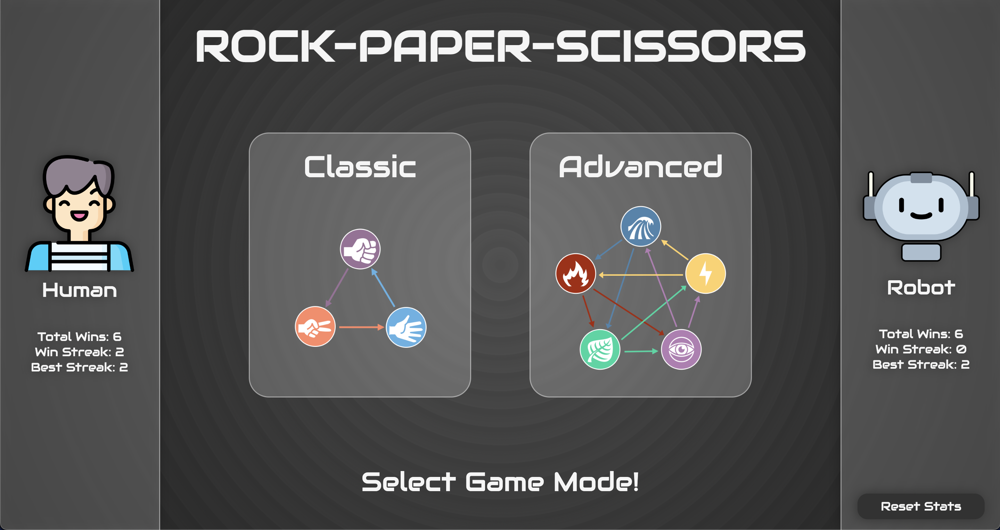

# Rock, Paper, Scissors
[//]: <> (Briefly describe what you built and its features. What problem is the app solving? How does this application solve that problem?)
This application allows a user to play the game Rock, Papers, Scissors against the computer who is making random selections. The user can play two different game modes: classic with 3 choices, and advanced with 5 choices. Total wins, current win streak, and longest win streak are saved and displayed for both the user and computer player.

### Installation Instructions:
##### Run via web
[Click Here to Launch](https://kirch1.github.io/rock-paper-scissors/)
##### Run local
1. Copy the SSH key on GitHub inside the code dropdown
2. Using the terminal, run `git clone [SSH key here]`
3. Run command `cd rock_paper_scissors` to move into the project directory
4. Run command `open index.html` to launch the application in the web browser

### Preview of App:
[//]: <> (Provide ONE gif or screenshot of your application - choose the "coolest" piece of functionality to show off.)

### Context:
[//]: <> (Give some context for the project here. How long did you have to work on it? How far into the Turing program are you?)
This project was built from scratch as my final Module 1 project at the Turing School of Software & Design. Students were provided with a project specification document, which detailed the required functionality. I used vanilla HTML, CSS, and Object Oriented JavaScript to implement all required features. Student were also allowed to choose our own theme and images, which I have done for this project.

### Contributors:
[//]: <> (Who worked on this application? Link to their GitHubs.)
- Jason Kirchman: [@kirch1](https://github.com/kirch1)

### Learning Goals:
[//]: <> (What were the learning goals of this project? What tech did you work with?)
- Solidify and demonstrate your understanding of:
    - DRY JavaScript
    - event delegation to handle similar event listeners
- Understand the difference between the data model and how the data is displayed on the DOM
- Use your problem solving process to break down large problems, solve things step by step, and trust yourself to not rely on an outside “answer” to a logical challenge

### Wins + Challenges:
[//]: <> (What are 2-3 wins you have from this project? What were some challenges you faced - and how did you get over them?)
- Win: Using CSS Flex to scale the fighters selection section.
- Win: Utilizing localStorage to save player statics, even after a refresh. 
- Win: Clean interaction between Game, Player, and Fighter classes.
- Challenge: Should I create a function for one line of code to improve readability? I ended up creating quite a few functions that helped a ton with game flow logic using timeouts.
- Challenge: Supporting smaller screen sizes in the fighter selection area. I use flex wrap to overcome this challenge.
